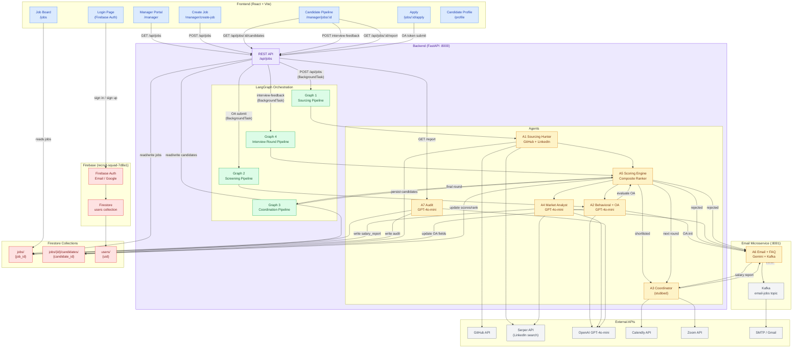

# RecruitSquad — High Level Design

## System Overview

RecruitSquad is a 7-agent autonomous recruitment platform built on FastAPI + LangGraph + Firebase Firestore.
Managers post jobs, and the system autonomously sources candidates, screens them via OA and behavioral interviews,
schedules interviews, performs market salary analysis, and generates audit reports.

## Architecture Diagram



## Pipeline Flows

| Flow | Trigger | Agent Chain |
|------|---------|-------------|
| **Sourcing** | Manager posts job | G1 → A1 → A5 → A2 → A6 (outreach emails) |
| **Screening** | Candidate submits OA | G2 → A2 → A5 → A3 (schedule) or A6 (reject) |
| **Interview Round** | Manager submits feedback | G4 → A5 → next round / G3 / reject |
| **Coordination** | Final round passed | G3 → A5 → A4 → A6 → A3 → A6 (confirmations) |
| **Audit** | Manager requests report | A7 → reads Firestore → structured report |

## Candidate Pipeline Stages

```
SOURCED → OA_SENT → BEHAVIORAL_COMPLETE → SCORED → SHORTLISTED
       → INTERVIEW_SCHEDULED → INTERVIEW_DONE → OFFERED → HIRED

Rejection stages: OA_FAILED | REJECTED | EXPERIENCE_REJECTED |
                  LOCATION_REJECTED | SALARY_REJECTED | OVERQUALIFIED_REJECTED
```

## Tech Stack

| Layer | Technology |
|-------|-----------|
| Frontend | React 18, Vite, Tailwind CSS, shadcn/ui, React Router v7 |
| Auth | Firebase Auth (Email/Password + Google) |
| Backend | FastAPI, Python 3.9+ |
| Orchestration | LangGraph (with fallback runners) |
| Database | Firebase Firestore |
| LLM | OpenAI GPT-4o-mini (A2, A4, A7) |
| Email | Gemini + Kafka (A6 microservice) |
| Sourcing | GitHub API + Serper API (LinkedIn) |
| Scheduling | Calendly + Zoom APIs (A3, stubbed) |
